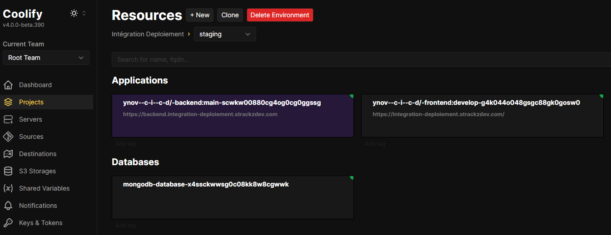
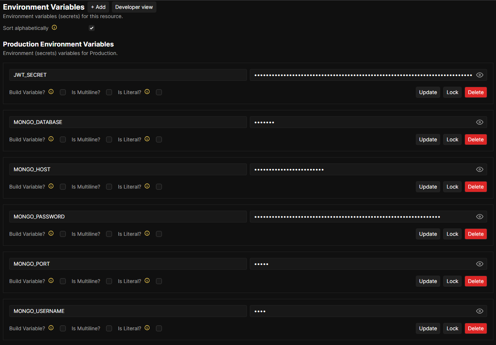
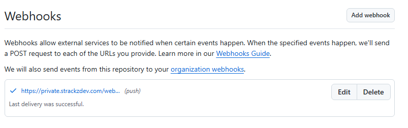
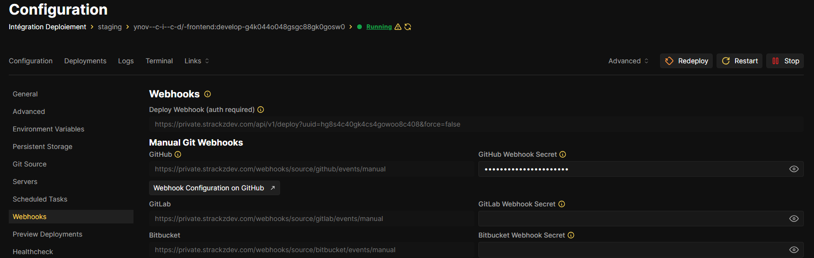
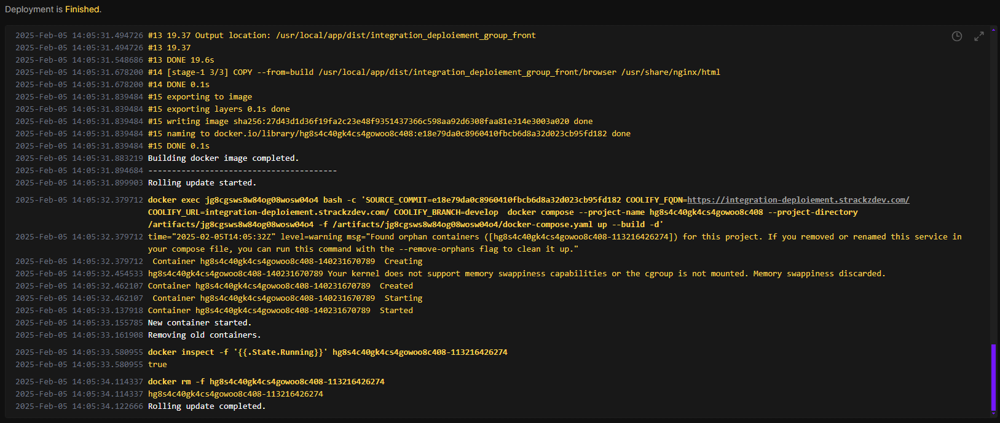

# Deployment

# References
- [Version Strategy](#version-strategy)

## Cloud
We chose **Coolify** for our cloud solution, benefiting from the option of using a personal VPS (We couldn't use vercel because we have an organisation).

### **Our deployment:**

All services are interconnected, enabling the product to be available online. I used my personal domain (strackzdev.com) and configured the SSL certificate with Let's Encrypt and Traefik to securely expose the frontend and backend over the HTTPS protocol.

### **Environment Variables**
We have our customised environment variables in our server deployment config as you can see bellow:

## Auto-deployment Strategy
In our GitFlow workflow, we protect the branches to ensure that developers merge from the feature branch into the develop branch (which is both protected and set as default). Once the pipeline in the feature branch succeeds, the code is rebased into develop, triggering a push event via a webhook. This webhook then redeploys the affected service.

### **Github webhook:**

### **Coolify webhook:**

### **Successful deployment**

## Version Strategy

**The version will be managed manually by the developer.**

In this project example, I decided to update the NPM repository only when the developer makes changes to the `package.json` version (not all file).

**Disclaimer:** During our classes, some students used the Auto-commit versions strategy, which often struggles with major version updates. This approach can also lead to issues such as developers not wanting to increment the version with every code push or conflicts arising from multiple merge requests with differing versions. I opted for this approach because it eliminates many headaches and potential problems.