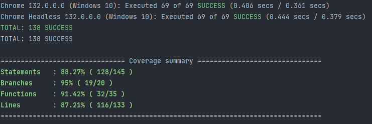
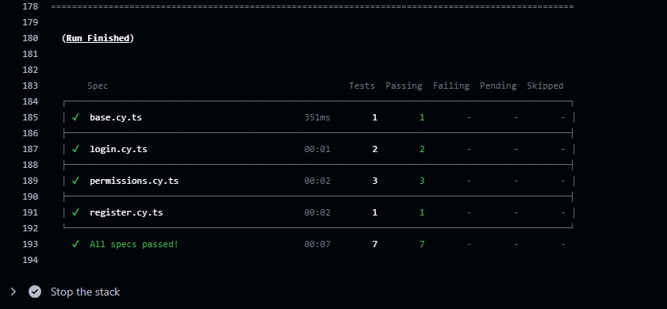
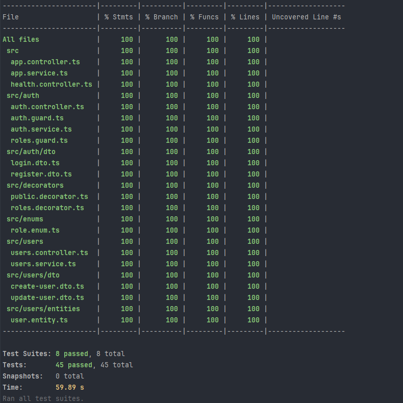
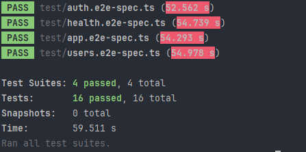
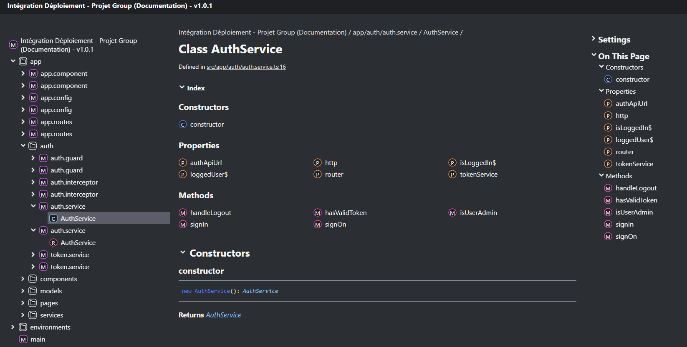
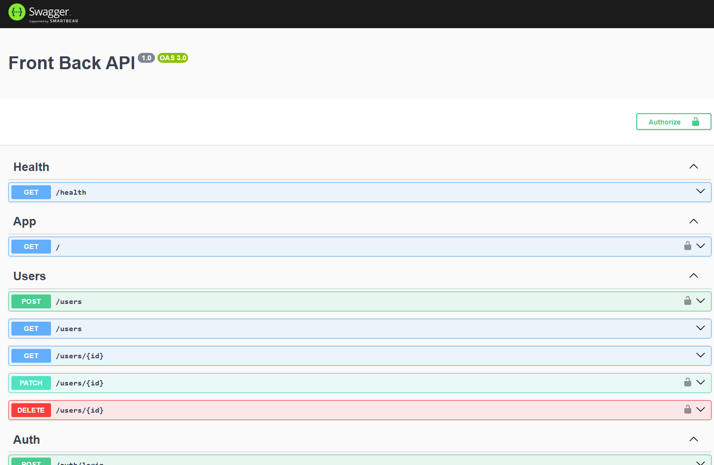

# Testing

# References
- [Frontend Unit/Integration tests](#frontend-unitintegration-tests)
- [Frontend e2e tests](#frontend-e2e-tests)
- [Backend Unit/Integration tests](#backend-unitintegration-tests)
- [Backend e2e tests](#backend-e2e-tests)
- [Codecov](#swagger)
- [TSDocs](#tsdocs)
- [Swagger](#swagger)

## Frontend Unit/Integration tests

Both Angular test types use Karma, the only difference lies in their implementation methods. However, both contribute to the overall test coverage percentage.

## Frontend e2e tests

We implemented Cypress for end-to-end (E2E) testing in our Angular application, ensuring reliable and automated validation of user interactions and application behavior.

Note: The screenshot in this case is taken directly from the tests in GitHub Actions, allowing us to confirm that the E2E tests are functioning properly within the pipeline.

## Backend Unit/Integration tests

We implemented Jest for unit and integration testing in our NestJS application, ensuring efficient and reliable validation of individual components and system interactions.

## Backend e2e tests

We used Supertest with Jest for end-to-end (E2E) testing in our NestJS backend, ensuring robust and reliable API validation.

## Codecov

We used Codecov to publish the evolution of testing coverage.

## TSDocs

We used TSDoc to document our code throughout the applications. Below, you can find some examples of how it's implemented:

## Swagger

We used Swagger both as a testing tool and for documenting our NestJS API.

